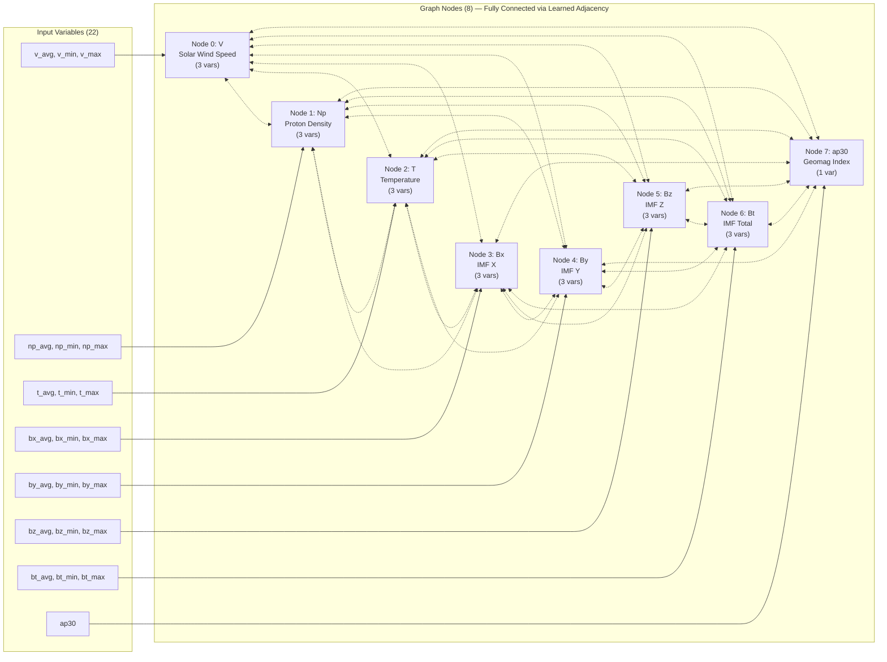
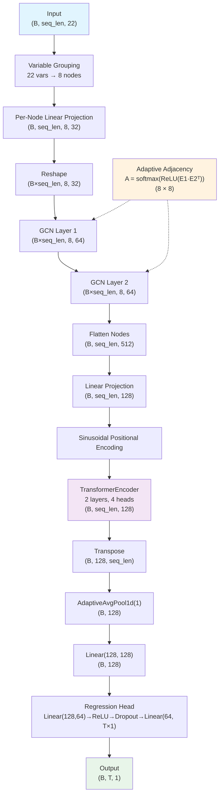
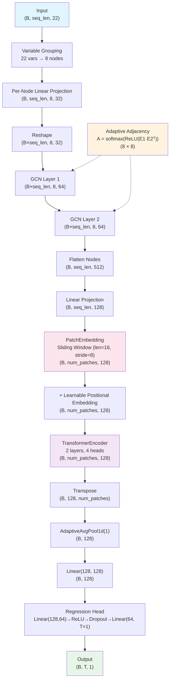

# GNN-Transformer & GNN-PatchTST Architecture / GNN-Transformer & GNN-PatchTST 아키텍처

Detailed architecture documentation for the two best-performing models in the regression-sw project.

regression-sw 프로젝트에서 가장 우수한 성능을 보인 두 모델의 상세 아키텍처 문서입니다.

**Reference code / 참조 코드**:
- `src/networks/gnn.py` — GNNEncoder, GNNOnlyModel, GraphConvLayer
- `src/networks/transformer.py` — PositionalEncoding
- `src/networks/patchtst.py` — PatchEmbedding
- `src/networks/_base.py` — DEFAULT_VARIABLE_NODE_GROUPS

---

## 1. GNN Common Structure / GNN 공통 구조

Both GNN-Transformer and GNN-PatchTST share the same **GNNEncoder** front-end. The only difference is the temporal encoder backend.

GNN-Transformer와 GNN-PatchTST는 동일한 **GNNEncoder** 전단부를 공유합니다. 차이점은 temporal encoder 후단부뿐입니다.

### 1.1 Solar Wind Variables as Graph Nodes / 태양풍 변수의 그래프 노드화

The 22 input solar wind variables are grouped into 8 physical phenomenon nodes:

22개 입력 태양풍 변수를 8개 물리적 현상 노드로 그룹화합니다:



> **Note / 참고**: All 8 nodes are **fully connected**. Edge weights are **not predefined** — they are learned via `A = softmax(ReLU(E1 · E2ᵀ))`. Dashed lines indicate that connection strengths are determined during training. Typically, Bz→ap30 and V→ap30 edges become strongest.
>
> 8개 노드는 **완전 연결(fully connected)** 되어 있습니다. 엣지 가중치는 **사전 정의되지 않고** `A = softmax(ReLU(E1 · E2ᵀ))`를 통해 학습됩니다. 점선은 연결 강도가 학습 중 결정됨을 나타냅니다. 일반적으로 Bz→ap30, V→ap30 엣지가 가장 강하게 학습됩니다.

Each node groups related statistical measures (avg/min/max) of a single physical quantity.

각 노드는 하나의 물리량에 대한 통계적 측정값(avg/min/max)을 그룹화합니다.

### 1.2 Adaptive Adjacency Matrix / 적응적 인접 행렬

The graph structure is not manually defined. Instead, the model learns which variables influence each other through two trainable node embeddings:

그래프 구조는 수동 정의가 아닙니다. 두 개의 학습 가능한 노드 임베딩을 통해 변수 간 영향 관계를 자동으로 학습합니다:

```
E1, E2 ∈ R^(8 × 16)     — learnable node embeddings
A = softmax(ReLU(E1 · E2ᵀ))  — adaptive adjacency matrix (8 × 8)
```

- `A[i,j]` represents the influence weight of node `j` on node `i`
- `A[i,j]`는 노드 `j`가 노드 `i`에 미치는 영향 가중치
- Physically meaningful: typically learns strong Bz→ap30, V→ap30 connections
- 물리적 의미 보유: 일반적으로 강한 Bz→ap30, V→ap30 연결을 학습
- Extractable via `model.adjacency_matrix` property for visualization
- `model.adjacency_matrix` 속성으로 시각화용 추출 가능

### 1.3 Per-Timestep GCN Message Passing / 타임스텝별 GCN 메시지 패싱

GCN is applied independently at each timestep to aggregate information across variables:

GCN은 각 타임스텝에서 독립적으로 적용되어 변수 간 정보를 집계합니다:

```
For each GCN layer:
    H' = ReLU(A @ H @ W + b) + Dropout

Where:
    H  = node features at current layer     (num_nodes × in_features)
    A  = adaptive adjacency matrix          (num_nodes × num_nodes)
    W  = learnable weight matrix            (in_features × out_features)
    H' = updated node features              (num_nodes × out_features)
```

Default: 2 GCN layers, `node_feature_dim=32 → gcn_hidden_dim=64`.

기본값: GCN 2개 층, `node_feature_dim=32 → gcn_hidden_dim=64`.

### 1.4 Tensor Shape Flow (GNN Front-End) / 텐서 Shape 흐름 (GNN 전단부)

Using the standard 2-day input (96 steps) as example:

표준 2일 입력(96 steps) 기준 예시:

```
Step 1 — Input split to nodes:
    (B, 96, 22) → split → [(B, 96, 3), (B, 96, 3), ..., (B, 96, 1)]  (8 groups)

Step 2 — Per-node linear projection:
    Each (B, 96, group_size) → Linear → (B, 96, 32)
    Stack → (B, 96, 8, 32)

Step 3 — Reshape for GCN:
    (B, 96, 8, 32) → (B×96, 8, 32)

Step 4 — GCN Layer 1:
    (B×96, 8, 32) → GraphConvLayer → ReLU → Dropout → (B×96, 8, 64)

Step 5 — GCN Layer 2:
    (B×96, 8, 64) → GraphConvLayer → ReLU → Dropout → (B×96, 8, 64)

Step 6 — Flatten nodes + reshape:
    (B×96, 8, 64) → (B, 96, 512)

    ↓ Temporal Encoder (differs between models) ↓
```

---

## 2. GNN-Transformer / GNN-Transformer 구조

**Config**: `model_type: "gnn"`, `gnn_temporal_type: "transformer"`

### 2.1 Full Pipeline Diagram / 전체 파이프라인 다이어그램



### 2.2 Temporal Encoder Detail — Transformer / Temporal Encoder 상세 — Transformer

After the GCN front-end produces `(B, seq_len, 512)`:

GCN 전단부가 `(B, seq_len, 512)`를 출력한 후:

```
Step 7 — Linear projection:
    (B, seq_len, 512) → Linear(512, 128) → (B, seq_len, 128)

Step 8 — Sinusoidal positional encoding:
    pe[pos, 2i]   = sin(pos / 10000^(2i/d_model))
    pe[pos, 2i+1] = cos(pos / 10000^(2i/d_model))
    x = x + pe[:seq_len]    → (B, seq_len, 128)

Step 9 — TransformerEncoder (2 layers):
    Each layer: MultiHeadSelfAttention(4 heads) → Add&Norm → FFN(256) → Add&Norm
    Attention: softmax(Q·Kᵀ / √32) · V    (head_dim = 128/4 = 32)
    → (B, seq_len, 128)

Step 10 — Global pooling:
    Transpose → (B, 128, seq_len) → AdaptiveAvgPool1d(1) → (B, 128)

Step 11 — Output projection:
    Linear(128, 128) → (B, 128)

Step 12 — Regression head:
    Linear(128, 64) → ReLU → Dropout(0.1) → Linear(64, T×1) → Reshape → (B, T, 1)
```

### 2.3 Key Characteristics / 주요 특징

- **Attention over full temporal sequence**: Each timestep attends to all others → captures long-range temporal dependencies directly
- **전체 시간 시퀀스에 attention 적용**: 각 타임스텝이 모든 다른 타임스텝에 attend → 장거리 시간 의존성 직접 포착
- **Sinusoidal PE**: Fixed positional encoding, no extra learnable parameters
- **Sinusoidal PE**: 고정 위치 인코딩, 추가 학습 파라미터 없음
- **Computational complexity**: O(seq_len²) for self-attention
- **연산 복잡도**: Self-attention에 O(seq_len²)
- **Best overall performance**: Ranked 1st across all experimental I/O windows
- **최고 전체 성능**: 모든 실험 I/O 구간에서 1위

### 2.4 Hyperparameters / 하이퍼파라미터

| Parameter | Default | Description |
|-----------|---------|-------------|
| `d_model` | 128 | Transformer feature dimension |
| `transformer_nhead` | 4 | Number of attention heads |
| `transformer_num_layers` | 2 | Number of encoder layers |
| `transformer_dim_feedforward` | 256 | FFN hidden dimension |
| `gnn_node_feature_dim` | 32 | Node feature dim after projection |
| `gnn_gcn_hidden_dim` | 64 | GCN hidden dimension |
| `gnn_num_gcn_layers` | 2 | Number of GCN layers |
| `gnn_node_embed_dim` | 16 | Embedding dim for adjacency learning |
| `gnn_dropout` | 0.1 | Dropout rate |

---

## 3. GNN-PatchTST / GNN-PatchTST 구조

**Config**: `model_type: "gnn"`, `gnn_temporal_type: "patch_transformer"`

### 3.1 Full Pipeline Diagram / 전체 파이프라인 다이어그램



### 3.2 Temporal Encoder Detail — PatchTST / Temporal Encoder 상세 — PatchTST

After the GCN front-end produces `(B, seq_len, 512)`:

GCN 전단부가 `(B, seq_len, 512)`를 출력한 후:

```
Step 7 — Linear projection:
    (B, seq_len, 512) → Linear(512, 128) → (B, seq_len, 128)

Step 8 — Patch embedding (sliding window tokenization):
    Pad if needed: (seq_len - patch_len) % stride != 0
    Unfold: (B, seq_len, 128) → (B, num_patches, patch_len, 128)
    Flatten + project: Linear(patch_len × 128, 128) → (B, num_patches, 128)
    Dropout applied

    Example (seq_len=96, patch_len=16, stride=8):
        num_patches = (96 - 16) / 8 + 1 = 11
        Each patch covers 16 × 30min = 8 hours of data

Step 9 — Learnable positional embedding:
    pos_embed ∈ R^(1, num_patches, 128), initialized N(0, 0.02)
    tokens = tokens + pos_embed[:, :num_patches, :]

Step 10 — TransformerEncoder (2 layers):
    Same architecture as GNN-Transformer, but attention is over patches, not timesteps
    Attention: softmax(Q·Kᵀ / √32) · V    (over 11 patches, not 96 timesteps)
    → (B, num_patches, 128)

Step 11 — Global pooling:
    Transpose → (B, 128, num_patches) → AdaptiveAvgPool1d(1) → (B, 128)

Step 12 — Output projection + Regression head:
    Same as GNN-Transformer
```

### 3.3 Patch Tokenization Process / 패치 토큰화 과정

The key innovation of PatchTST is converting a long sequence into fewer patch tokens:

PatchTST의 핵심은 긴 시퀀스를 적은 수의 패치 토큰으로 변환하는 것입니다:

```
Input sequence (seq_len=96, d_model=128):

Timestep:  [t0][t1][t2]...[t7] [t8][t9]...[t15] [t16]...[t23] ... [t88]...[t95]
            ├── patch 0 ──────┤
                ├── patch 1 ──────────────┤
                    ├── patch 2 ──────────────────┤
                                                           ...
                                                      ├── patch 10 ─────┤

patch_len = 16 (8 hours of data per patch)
stride = 8     (50% overlap between consecutive patches)
num_patches = 11

Each patch: (16 × 128) → flatten → Linear → (128)
Result: 96 timesteps → 11 patch tokens
```

### 3.4 Key Characteristics / 주요 특징

- **Patch-level attention**: Attends over patches instead of individual timesteps → dramatically fewer tokens
- **패치 단위 attention**: 개별 타임스텝 대신 패치 단위로 attend → 토큰 수 대폭 감소
- **Local pattern preservation**: Each patch directly encodes local temporal patterns (8h window)
- **로컬 패턴 보존**: 각 패치가 로컬 시간 패턴(8시간 윈도우)을 직접 인코딩
- **Learnable PE**: Position embeddings are learned (not fixed sinusoidal), initialized from N(0, 0.02)
- **Learnable PE**: 위치 임베딩이 학습됨 (고정 sinusoidal 아님), N(0, 0.02)에서 초기화
- **2nd best overall**: Close to GNN-Transformer, more efficient for long inputs
- **전체 2위**: GNN-Transformer에 근접, 긴 입력에서 더 효율적

### 3.5 Additional Hyperparameters / 추가 하이퍼파라미터

In addition to the GNN common parameters (§2.4):

GNN 공통 파라미터(§2.4)에 추가:

| Parameter | Default | Description |
|-----------|---------|-------------|
| `patch_len` | 16 | Timesteps per patch (default covers 8 hours) |
| `patch_stride` | 8 | Stride between patches (50% overlap) |

**Note**: `patch_len` must be ≤ `input_sequence_length`. For short inputs (e.g., 6h = 12 steps), override these values in the I/O config.

**주의**: `patch_len`은 `input_sequence_length` 이하여야 합니다. 짧은 입력(예: 6h = 12 steps)에서는 I/O config에서 이 값을 override해야 합니다.

---

## 4. GNN-Transformer vs GNN-PatchTST Comparison / 비교

### 4.1 Architectural Differences / 아키텍처 차이점

| Aspect | GNN-Transformer | GNN-PatchTST |
|--------|----------------|--------------|
| Temporal input | Per-timestep features | Patch tokens (grouped timesteps) |
| Positional encoding | Sinusoidal (fixed) | Learnable (trained) |
| Attention target | Individual timesteps | Patches (local groups) |
| Token count (2d input) | 96 | 11 |
| Attention complexity | O(seq_len²) | O(num_patches²) |
| Local pattern encoding | Implicit via attention | Explicit via patch grouping |

### 4.2 Computational Complexity / 연산 복잡도

Attention computation comparison across input lengths:

입력 길이별 attention 연산 비교:

| Input | seq_len | Transformer tokens | PatchTST tokens (16/8) | Attention ratio |
|-------|---------|-------------------|----------------------|-----------------|
| 6h | 12 | 12 | 5 (patch=4, stride=2)* | O(144) vs O(25) |
| 12h | 24 | 24 | 2 | O(576) vs O(4) |
| 1d | 48 | 48 | 5 | O(2,304) vs O(25) |
| 2d | 96 | 96 | 11 | O(9,216) vs O(121) |
| 3d | 144 | 144 | 17 | O(20,736) vs O(289) |

*6h input requires `patch_len=4, patch_stride=2` override (default `patch_len=16` > 12 steps).

*6h 입력은 `patch_len=4, patch_stride=2` override 필요 (기본 `patch_len=16` > 12 steps).

### 4.3 When to Use Which / 언제 어떤 모델을 사용할 것인가

| Scenario / 시나리오 | Recommended / 권장 | Reason / 이유 |
|---------|---------|------|
| Best accuracy / 최고 정확도 | GNN-Transformer | Ranked 1st overall / 전체 1위 |
| Long input (≥2d) / 긴 입력 | GNN-PatchTST | Efficient attention / 효율적 attention |
| Short input (6-12h) / 짧은 입력 | GNN-Transformer | Few patches reduce PatchTST effectiveness / 패치 수 적어 PatchTST 효과 감소 |
| Interpretability / 해석 가능성 | Either / 둘 다 | Both have graph + attention / 둘 다 그래프 + attention 보유 |
| Training speed / 학습 속도 | GNN-PatchTST | Fewer tokens → faster attention / 적은 토큰 → 빠른 attention |

---

## 5. End-to-End Data Flow Summary / 전체 데이터 흐름 요약

### GNN-Transformer (2-day input, 12h output)

```
(B, 96, 22) ─── Input
     │
     ▼
  Split to 8 node groups
     │
     ▼
(B, 96, 8, 32) ─── Per-node projection
     │
     ▼
(B×96, 8, 32) ─── Reshape for GCN
     │
     ├── × Adaptive Adj (8×8)
     ▼
(B×96, 8, 64) ─── GCN × 2 layers
     │
     ▼
(B, 96, 512) ─── Flatten nodes
     │
     ▼
(B, 96, 128) ─── Linear projection
     │
     ▼
(B, 96, 128) ─── + Sinusoidal PE
     │
     ▼
(B, 96, 128) ─── TransformerEncoder (2L, 4H)
     │
     ▼
(B, 128) ─── Global AvgPool + Linear
     │
     ▼
(B, 24, 1) ─── Regression Head
```

### GNN-PatchTST (2-day input, 12h output)

```
(B, 96, 22) ─── Input
     │
     ▼
  Split to 8 node groups
     │
     ▼
(B, 96, 8, 32) ─── Per-node projection
     │
     ├── × Adaptive Adj (8×8)
     ▼
(B×96, 8, 64) ─── GCN × 2 layers
     │
     ▼
(B, 96, 512) ─── Flatten nodes
     │
     ▼
(B, 96, 128) ─── Linear projection
     │
     ▼
(B, 11, 128) ─── PatchEmbedding (len=16, stride=8)
     │
     ▼
(B, 11, 128) ─── + Learnable PE
     │
     ▼
(B, 11, 128) ─── TransformerEncoder (2L, 4H)
     │
     ▼
(B, 128) ─── Global AvgPool + Linear
     │
     ▼
(B, 24, 1) ─── Regression Head
```

---

## 6. Reference / 참고

- **PatchTST**: Nie et al., "A Time Series is Worth 64 Words: Long-term Forecasting with Transformers" (ICLR 2023)
- **GNN for space weather**: Abduallah et al., "Prediction of the SYM-H Index Using a Graph Neural Network and LSTM Hybrid Approach" (Space Weather, 2024)
- **Adaptive Graph Learning**: Wu et al., "Graph WaveNet for Deep Spatial-Temporal Graph Modeling" (IJCAI 2019)
